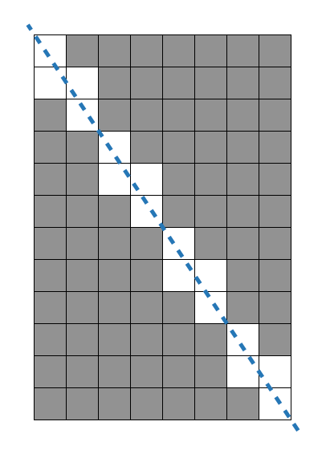

[[info | 프로그래머스 멀쩡한 사각형 문제 보러가기]]
| https://programmers.co.kr/learn/courses/30/lessons/62048


#### 배운점

- 파이썬으로 소수점을 계산할 일이 있다면 나누기를 반복하기보단 곱하기 한 뒤 나눗셈을 하도록 식을 수정하자.
- 집합 자료형으로 중복을 피할 수 있다.

## 문제 요약



전체 사각형의 width, height가 주어졌을 때 선을 지나지 않는 검정색 사각형의 갯수를 구하라

#### 조건

- W, H는 1억 이하의 자연수

## 문제 접근 방식

1. 하나의 직선이 있었고 직선이 큰 사각형 안의 작은 사각형과 만나는 횟수가 흰 사각형의 갯수이다. *풀이 1*
2. 18개중 12개는 정답 6개는 시간초과를 받았다.
3. 자세히보면 패턴이 중복될 것임을 깨달았다.
4. 중복의 횟수는 최대공약수와 같았고 내가 구하고자 하는 문제는 작은 문제로 나눠질 수 있었다. 작은문제 * 최대공약수 *풀이 2*
5. 18개 중 14개는 정답 4개는 시간초과를 받았다.
6. 계산할 필요가 없는 조건들을 찾아내서 추가했다. `fw==1 or fh==1` , `fw==fh`  *풀이 3*
7. 18개 중 16개는 정답 2개는 시간초과를 받았다.
8. 정답을 찾아봤다 ㅠㅠ 역시 머리가 나쁘면 고생한다.. [링크 ](https://leedakyeong.tistory.com/entry/%ED%94%84%EB%A1%9C%EA%B7%B8%EB%9E%98%EB%A8%B8%EC%8A%A4-%EB%A9%80%EC%A9%A1%ED%95%9C-%EC%82%AC%EA%B0%81%ED%98%95-in-python) *어느 천재의 풀이*
9. 아 추가적으로 직선을 구할 때 `a=h/w` 한 뒤 x를 구하기 위해 `x=y/a` 를 했었다. 그런데 이는 파이썬에서 소수점 나눗셈의 연산의 오차가 있어 문제가 되었었다. `x=w*y/h` 로 수정한 뒤 문제가 해결되었었다.

## 풀이코드

#### 풀이 1 (12/18)

```python
def solution(w, h):
    points = set()
    a = h/w # 불필요
    for x in range(1, w+1):
        y = h*x/w
        # y = a*x
        if y <= h:
            points.add((x, y))
    for y in range(1, h+1):
        x = w*y/h
        # x = y/a
        if x <= w:
            points.add((x, y))
    return w*h - len(points)
```

#### 풀이 2 (14/18)

```python
import math
def solution(fw, fh):
    gcd = math.gcd(fw, fh)
    w = fw // gcd
    h = fh // gcd
    points = set()
    for x in range(1, w+1):
        y = h*x/w
        if y <= h:
            points.add((x, y))
    for y in range(1, h+1):
        x = w*y/h
        if x <= w:
            points.add((x, y))
    return fw*fh - len(points) * gcd

```

#### 풀이 3 (16/18)

```python
import math
def solution(fw, fh):
    if fw == 1 or fh == 1:
        return 0
    elif fw == fh:
        return fw * fh - fw
    gcd = math.gcd(fw, fh)
    w = fw // gcd
    h = fh // gcd
    points = set()
    a = h/w
    for x in range(1, w+1):
        y = h*x/w
        # y = a*x
        if y <= h:
            points.add((x, y))
    for y in range(1, h+1):
        x = w*y/h
        # x = y/a
        if x <= w:
            points.add((x, y))
    return fw*fh - len(points) * gcd
```

#### 어느 천재의 풀이

```python
import math
def solution(w,h):
    return w*h - (w+h-math.gcd(w,h))
```

