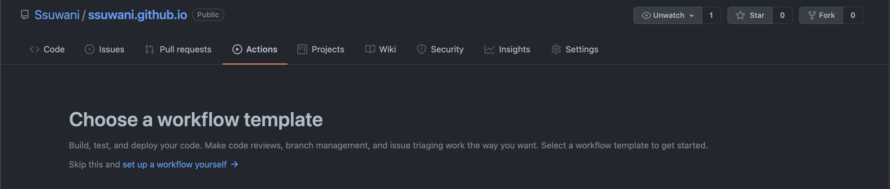
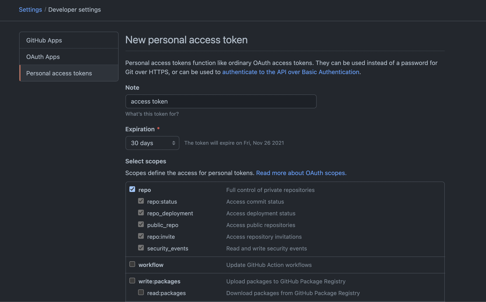
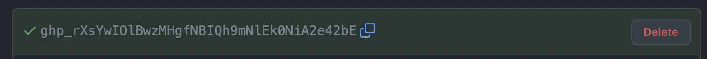
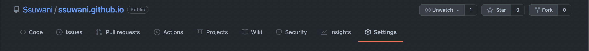
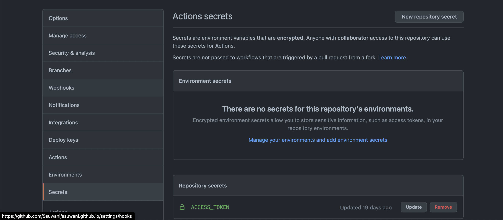
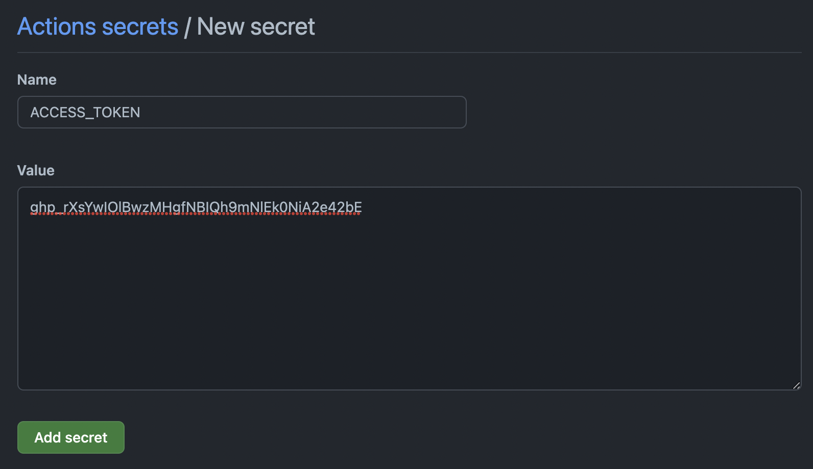

[[info | CI & CD 툴, Github Action을 이용한 Gatsby 블로그 배포 자동화 방법을 간단하게 기록합니다. ]]


### 기존의 방식

일단 2개의 branch가 필요하다

- `master` : 배포를 위한 정적 파일 위치
- `develop ` : Gatsby 코드 파일 위치

사실 이름은 중요하지 않다. settings -> pages -> source 에서 정적 파일의 브랜치를 변경할 수 있다. 또한 settings -> branches -> default branch에서 레포지토리 접근 시 보여지는 branch를 변경할 수 있다. 위의 경우 `develop` 로 변경하면 조금 더 깔끔해 보인다.


`master` 브랜치에 `gatsby build`  명령어를 통해 만들어진 `public` 폴더를 위치시키기 위해 `package.json` 에 `deploy` 라는 명령어로 `gatsby build && gh-pages -d public -b master` 를 실행할 수 있게 한다.  보통 아래와 같다.

```json
"scripts": {
  "build": "gatsby build",
  "start": "gatsby develop",
  "serve": "gatsby serve",
  "deploy": "gatsby build && gh-pages -d public -b master"
}
```

그러니까 블로그 관리자 입장에서 블로그에 글을 올리려면 다음과 같은 과정이 있다.

```bash
npm run deploy
# 사실 위의 명령어를 되게 좋다!? 아래의 일을 한번에 해준다.
# 1. gatsby build
# 2. public folder to master branch
# 3. add & commit & push

# 하지만 추가적으로 내 코드 관리를 해야하기 때문에 deploy 브랜치도 추가해줘야 한다.
git add .
git commit -m "Meesage"
git push
```


사실 어려울 건 없다. 

### Github Action을 이용한 배포 자동화

뭔가 모든 일을 다 해줄 것 같은 이름을 지었지만 고작 한단계를 줄여볼거다..

바로 `npm run deploy` 이거!

블로그가 배포된 레포지토리에서 `Actions` 탭에 들어가자. **set up a workflow yourself** 클릭




아래의 코드를 작성하자

```yaml
name: Gatsby Publish
on:
  push:
    branches:
      - develop # 1
jobs:
  build:
    runs-on: ubuntu-latest # 2
    steps:
      - uses: actions/checkout@v2 # 3
      - uses: enriikke/gatsby-gh-pages-action@v2 # 4
        with:
          access-token: ${{ secrets.ACCESS_TOKEN }} # 5
```

간단히 아는만큼 설명해보겠다.

1. 언제 이 workflow가 실행될지를 결정하는 부분이다. 위의 예시는 `develop` 브랜치에 `push` 가 되었을 때 실행된다는 의미이다.

2. Github Action은 하나의 컨테이너 위에서 동작한다. `ubuntu-latest` 에서 동작시키겠다는 의미이다. 어디서 봤는데 `macos` , `windows` 에서도 동작시킬 수 있다고 한다. 이에따라 더 세부적인 작업들도 가능하다.

3. steps에 있는 각 uses는 서로 다른 작업들이라고 이해하면 되는데 `actions/checkout@v2` 는 내 레포지토리를 가져온다는 정도로 이해하고 있다.

4. 핵심부분인데 정확하겐 모른다..  궁금한 사람은 [여기](https://github.com/enriikke/gatsby-gh-pages-action)를 참고하자!!

5. 4번에서 필요로 하는 Github에 접근을 위한 토큰이다. `secrets.<props>` 는 레포지토리 Secrets을 불러오는 문법이다.

    

    

#### Repository secrets 설정하기

**ACCESS TOKEN 발급받기**

https://github.com/settings/tokens 여기서 `Generate new token`을 클릭한다.

그리고 아래와 같이 입력하고 아래의 `Generate Token`을 클릭한다.



그러면 생성되는 아래의 토큰을 복사한다.



**발급받은 Access Token Secrets에 저장하기**

Settings로 이동



Secrets 클릭 후 오른쪽 위에 보이는 `New repository secret` 르 클릭한다.



아래와 같이 추가하자




<br/>

이제 내가 Postring을 하기 위해 할 일은 `deploy` 브랜치 위에서 

```bash
git add .
git commit -m "Meesage"
git push
```

이상이다.
