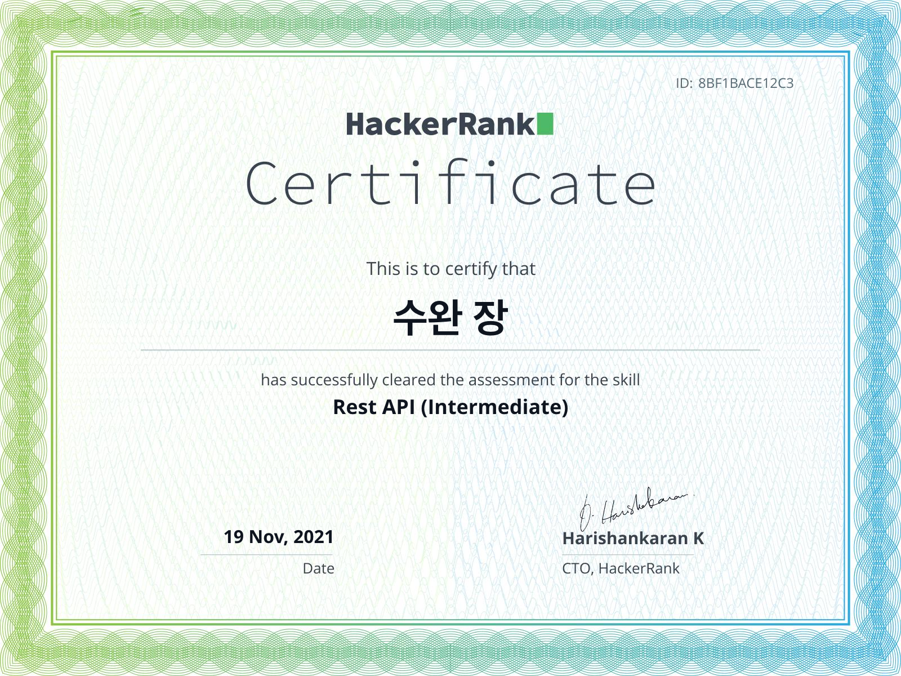

해커랭크는 백준, 프로그래머스와 같이 코딩 문제를 풀 수 있는 온라인 사이트이다. 다만 해외 사이트이다. 한국어를 지원하고 있지 않아 모두 영어로 되어 있다 ㅠㅠ. 

우연히 어떠한 알고리즘이 나를 해커랭크로 이끌었고 취준생인 나는 인증 탭에 눈이 갔다. RestAPI가 좀 재밌을 거 같아 먼저 클릭했다.

2문제 90분이 주어졌던거 같다! HTTP GET을 이용해 받은 response를 적절히 파싱하는 문제였다. 시간이 딱 떨어지게 다 풀었다. 쉬워서 그랬나? 재밌었다. 시간이 딱 떨어졌으면 쉬웠던건 아닌가..? 어쨌든 재밌었다!!!

한 20분 뒤에 메일로 아래의 인증서가 왔다! 뭔가 뿌듯해서 Python도 도전했다. RestAPI는 Intermediate로 되어 있었지만 Python은 Basic밖에 없었다. 아것도 2문제가 나왔지만 120분이 주어졌던 걸로 기억한다. 요즘 코딩테스트를 풀어서 그런가 이건 너무 재미없었다. 

**해커랭크 Python 인증서**

**해커랭크 RestAPI 인증서**

