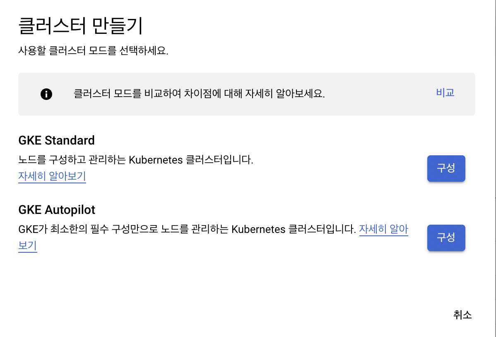
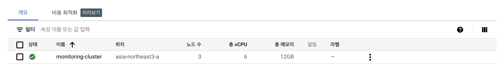
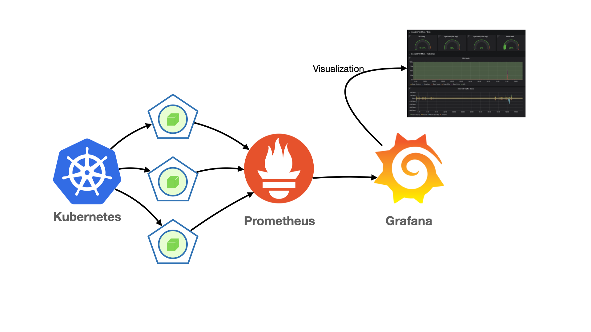
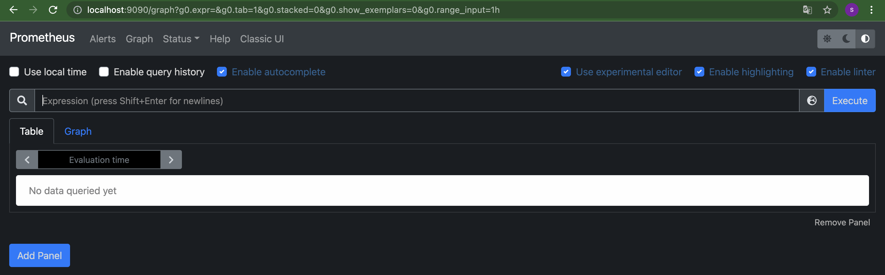
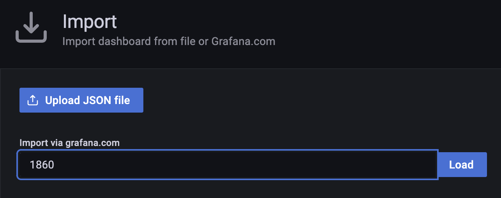
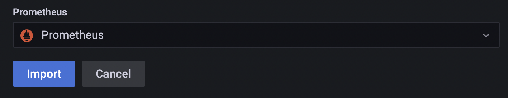
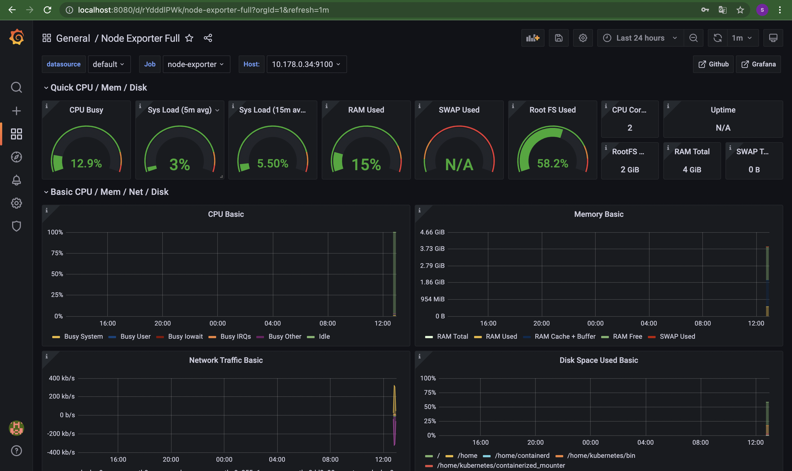
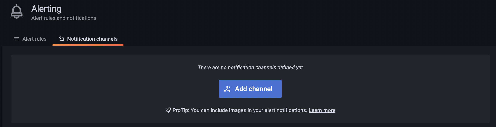
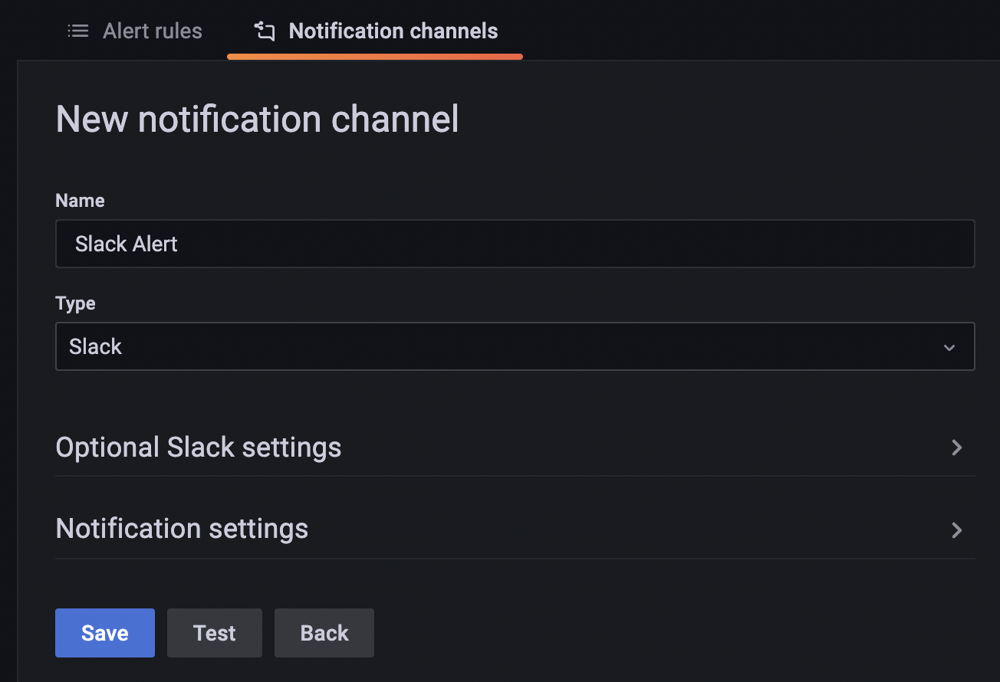
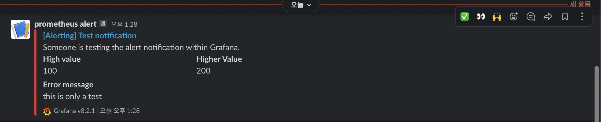

# GKE를 통한 쿠버네티스 클러스터 생성 및 Prometheus & Grafana 시각화와 알람 설정

**목차**

1. Cluster 만들기 ✅
2. Cloud SDK로 손쉽게 클러스터 다루기 ✅
3. Prometheus & Grafana 설치 ✅
4. Slack Alert ✅

---

# 1. Cluster 만들기

GCP의 Google Kubernetes Engine 을 이용해서 Cluster를 만들고자 한다. 가입을 하면 300불(한화로 약 350,000원)을 3개월간 사용할 수 있게 제공해준다. 

#### **1. GKE Standard 선택**

[https://console.cloud.google.com/kubernetes](https://console.cloud.google.com/kubernetes) 로 이동해서 클러스터 만들기를 클릭하면 GKE Standard 혹은 GKE Autopilot 둘 중 선택할 수 있다. Autopilot이 필수 구성만으로 클러스터를 설정해주고 간편하게 scaling을 할 수 있다고하여 선택했었지만 이후에 Kubeflow Pipeline을 설정하는 중 Autopilot을 통해 만든 클러스터에서는 제공되지 않는다고 하였다. **GKE Standard를 선택하자.**



#### **2. 기본사항 입력**

클러스터 이름: **monitoring-cluster**

위치유형: 영역 → **asia-northeast3-a** (GCP의 한국리젼의 위치이다. 속도에서 이점이 있다.)

기타: 노드 수, 머신 유형 등 다양한 선택을 할 수 있지만 default로 둔다.

#### **3. 만들기**

만들기 클릭 후 5분정도이 시간이 소요되었다.




클러스터의 이름을 클릭하면 더 세부적인 내용들을 확인할 수 있다. default로 만든 사양은 다음과 같다.

- Node 3개
- CPU 6개
- RAM 12GB

이는 머신유형 e2-medium 에 해당되는 사양이다. 이후에 사양이 부족하여 Pod가 **<Pending>** 으로 유지가 되어 확장을 원할 때 머신유형은 변경할 수 없지만 **노드의 수를 늘려서 문제를 해결할 수 있다**.  
클러스터 세부정보 → 노드 → 노트 풀 → 수정 → 노드 수 변경

# 2. Cloud SDK로 손쉽게 클러스터 다루기

#### **1. Cloud SDK 설치**

GKE 홈에서 오른쪽 상단의 Cloud Shell을 이용하면 Cluster에 접근이 가능하다. 하지만 번거로워지는 일이 많다. 

[https://cloud.google.com/sdk/docs/install](https://cloud.google.com/sdk/docs/install) 여기를 참고하여 설치하자.

설치를 마치고나면 `gcloud init` 을 통해 설정을 추가하면 로컬 터미널에서 클러스터에 바로 접근이 가능하다. 

#### **2. 설치 확인 및 클러스터 접근**

`kubectl get pods -A` 명령어를 통해 Cluster에 배포된 Pod들을 확인할 수 있다. 

- kubectl을 아직 설치하지 않았다면 [여기](https://kubernetes.io/ko/docs/tasks/tools/#kubectl)를 확인하자.

```bash
>>> kubectl get pods -A

NAMESPACE     NAME                                                           READY   STATUS    RESTARTS   AGE
kube-system   event-exporter-gke-67986489c8-frqpf                            2/2     Running   0          11m
kube-system   fluentbit-gke-5nbl9                                            2/2     Running   0          11m
kube-system   fluentbit-gke-66m6n                                            2/2     Running   0          11m
kube-system   fluentbit-gke-975p9                                            2/2     Running   0          11m
kube-system   gke-metrics-agent-l26d9                                        1/1     Running   0          11m
kube-system   gke-metrics-agent-lxw8z                                        1/1     Running   0          11m
kube-system   gke-metrics-agent-z8s65                                        1/1     Running   0          11m
kube-system   konnectivity-agent-7664bbd67c-5gbb6                            1/1     Running   0          11m
kube-system   konnectivity-agent-7664bbd67c-lltk8                            1/1     Running   0          11m
kube-system   konnectivity-agent-7664bbd67c-ngllk                            1/1     Running   0          11m
kube-system   konnectivity-agent-autoscaler-6cb774c9cc-8hfgh                 1/1     Running   0          11m
kube-system   kube-dns-autoscaler-844c9d9448-x8c7h                           1/1     Running   0          11m
kube-system   kube-dns-b4f5c58c7-8q7k2                                       4/4     Running   0          11m
kube-system   kube-dns-b4f5c58c7-tzdfv                                       4/4     Running   0          11m
kube-system   kube-proxy-gke-monitoring-cluster-default-pool-197cd47e-12dh   1/1     Running   0          10m
kube-system   kube-proxy-gke-monitoring-cluster-default-pool-197cd47e-nz04   1/1     Running   0          10m
kube-system   kube-proxy-gke-monitoring-cluster-default-pool-197cd47e-tblp   1/1     Running   0          10m
kube-system   l7-default-backend-56cb9644f6-29s4b                            1/1     Running   0          11m
kube-system   metrics-server-v0.3.6-9c5bbf784-6xfkr                          2/2     Running   0          10m
kube-system   pdcsi-node-9s4l2                                               2/2     Running   0          11m
kube-system   pdcsi-node-dbtd6                                               2/2     Running   0          11m
kube-system   pdcsi-node-fblcx                                               2/2     Running   0          11m
```

# 3. Prometheus & Grafana 설치

특히 모델 학습을 하는 머신러닝 프로젝트에서 효율적인 하드웨어 관리를 위해서는 모니터링이 필수적이다. 



시각화까지의 과정을 간단히 그려보았다. 프로메테우스는 pulling의 방법을 사용하여 각종 메트릭을 수집하는 역할을 하고, 그라파나는 이를 이용하여 시각화하는 역할을 수행한다.

####**1. Helm 설치**

Helm은 쿠버네티스 패키지 배포를 손쉽게 해주는 패키지 매니저이다. (nodejs의 npm, python의 pip와 비슷하고 kubectl, kustomize, helm 이렇게 3개가 대표적인 kubenetes용 패키지 매니저이다.)

설치는 간단히 kubectl과 비슷하게 binary 파일을 다운받아 적절한 위치에 추가만 해주면 된다.

[https://helm.sh/ko/docs/intro/install/](https://helm.sh/ko/docs/intro/install/) 를 참고하자.

#### **2. Prometheus Operator 설치로 한방에 필요한 도구들 설치**

Prometheus와 Grafana의 설치를 차근차근 따라간다면 설치해야 할 것들이 정말 많다. 

데이터 수집을 도와주는 node-exporter, Pod에 대한 지표를 생성하는 kube-state-metrics 

이를 한번에 설치해주는 Promethues-Operator를 설치해보자. (이를 제대로 사용하기 위해선 Operator Framework에 대한 개념이 필요한 것으로 보인다. [여기](https://devthomas.tistory.com/6)를 참고해서 더 공부하자.)

```
## prometheus-community 레포 추가
helm repo add prometheus-community https://prometheus-community.github.io/helm-charts

# 네임스페이스 생성
kubectl create namespace monitoring

# 설치
helm install -n monitoring monitor prometheus-community/kube-prometheus-stack
```

38 ~ 

#### **3. 동작확인**

```
>>> kubectl get svc -n monitoring

NAME                                      TYPE        CLUSTER-IP     EXTERNAL-IP   PORT(S)                      AGE
alertmanager-operated                     ClusterIP   None           <none>        9093/TCP,9094/TCP,9094/UDP   8s
monitor-grafana                           ClusterIP   10.32.8.212    <none>        80/TCP                       30s
monitor-kube-prometheus-st-alertmanager   ClusterIP   10.32.9.98     <none>        9093/TCP                     30s
monitor-kube-prometheus-st-operator       ClusterIP   10.32.1.45     <none>        443/TCP                      30s
monitor-kube-prometheus-st-prometheus     ClusterIP   10.32.8.236    <none>        9090/TCP                     30s
monitor-kube-state-metrics                ClusterIP   10.32.14.210   <none>        8080/TCP                     30s
monitor-prometheus-node-exporter          ClusterIP   10.32.2.7      <none>        9100/TCP                     30s
prometheus-operated                       ClusterIP   None           <none>        9090/TCP                     8s
```

내가 관심있는 것은 `monitor-kube-prometheus-st-prometheus`와 `monitor-grafana` 이다 Type이 ClusterIP로 되어있는 것을 확인하자.

#### **4. Prometheus UI 접속하기**

서비스 타입이 ClusterIP라면 LoadBalancer혹은 NodePort로 변경하거나 Port-forwarding을 통해 Pod에 직접 접근해야한다. 포트포워딩을 통해 접근해보자.

```
kubectl -n monitoring port-forward svc/monitor-kube-prometheus-st-prometheus 9090:9090
```

[localhost:9090](http://localhost:9090) 에 접근해보자. 아래와 같은 화면을 볼 수 있다. 크게 3개의 탭으로 구성되어 있다. Alert, Graph, Status. 특히 Status → Target 에 보면 어디서 어떠한 데이터를 가져오는지 확인할 수 있다. 또한 Alert 탭을 확인해보면 기본적으로 다양한 조건들에 대한 Alert이 활성화 되어 있는것을 볼 수 있다.



#### **5. Grafana UI 접속하기**

```
kubectl -n monitoring port-forward svc/monitor-grafana 8080:80
```

[localhost:8080](http://localhost:8080) 에 접근해보자. Login을 해야하는데 Prometheus-Operator를 통해 설치했다면 username: `admin` password: `prom-operator` 로 로그인이 가능하다.

각각을 따로 설치했다면 Data Source로 Prometheus 를 등록해야 하는데 이미 등록되어 있다.

시각화를 위한 대시보드를 만들어보자. 아니 불러와보자. 그라파나에서는 프로메테우스의 정보들을 Prometheus Query(PromQL)를 통해 불러올 수 있고, 이를 통해 대시보드를 만들 수 있다. 하지만 다른 사람이 만들어놓은 대시보드를 Import 하고 필요에 따라 세부적인 사항들을 수정해 사용할수도 있다.

Import로 이동해서 [Node Exporter Full](https://grafana.com/grafana/dashboards/1860) 를 추가해보자. ID값은 1860이다.



Datasource로 Prometheus를 선택하고 Import를 누르면 된다.



다음과 같은 화면을 확인할 수 있다.



보이는 것 외에도 아래에 더 많은 정보들을 확인할 수 있다. 필요에 따라 대시보드를 수정하고 나만의 대시보드를 만들어 나가자.

# 4. Slack Alert

Grafana에서 Notification Channel을 추가함으로써 손쉽게 Slack으로 알람을 받을 수 있다.

#### **1. Slack Webhook URL 생성**

Webhook은 외부 시스템에서 슬랙으로 post message를 전달하기 위한 Endpoint라고 이해하면 될 것 같다. Slack Webhook 이라고 검색하면 다양한 블로그들이 있으므로 참고해서 발급받자.

#### **2. Grafana Alert 등록 및 테스트** 
1. Grafana UI에서 Alerting 탭을 찾을 수 있을 것이다. Notification channel 탭에서 **Add Channel을 클릭하자.**
   
    
    
2. 다음과 같은 화면이 나오는데 적절한 이름과 **Type은 Slack**으로 설정한 뒤 Optional Slack settings 에서 **Webhook URL를 입력하자.**
   
    
    
3. 그리고 **Test**를 눌러 Slack에 알람이 잘 오는지 확인해보자
   
    
    
4. Save