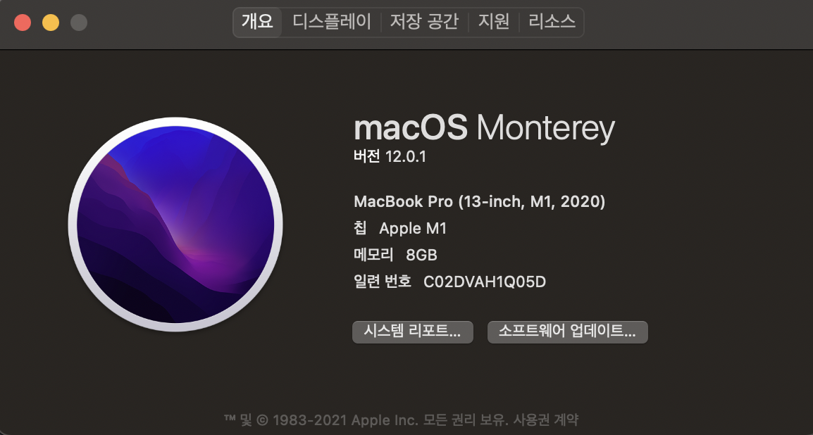

M1에서 드디어 GPU 가속을 공식적으로 지원한다.. 다만 최신 macos인 Monterey로 설치해야 한다. [여기](https://developer.apple.com/metal/tensorflow-plugin/)에서 확인할 수 있다. 들어가면 설치법도 나와있으니 거기를 확인하는 게 더 좋을 수 있다. 지금 현재 (2021.11.13) 시점에서 Tensorflow를 설치하고 Jupyter Lab 설치까지의 과정을 기록해두려 할 뿐이다.


## 1. Install Xcode

Xcode가 설치되어 있어야 한다. 대게 설치되어 있으리라 생각된다.

```bash
xcode-select --install
```


## 2. Install Miniforge

[여기](https://github.com/conda-forge/miniforge/releases/latest/download/Miniforge3-MacOSX-arm64.sh)를 클릭하면 Miniforge3-MacOSX-arm64.sh 파일을 다운받을 수 있다.

```bash
chmod +x ~/Downloads/Miniforge3-MacOSX-arm64.sh
sh ~/Downloads/Miniforge3-MacOSX-arm64.sh
source ~/miniforge3/bin/activate
```


## 3. Create Env

```bash
conda create -n tf python==3.9 -y
conda activate tf
```


## 4. Install Tensorflow

```bash
conda install -c apple tensorflow-deps
pip install tensorflow-macos
pip install tensorflow-metal
```


이까지 진행하면 아래와 같이 tensorflow 설치를 확인할 수 있다.

```bash
>>> import tensorflow as tf

>>> tf.__version__
'2.6.0'

>>> tf.config.list_physical_devices()
[PhysicalDevice(name='/physical_device:CPU:0', device_type='CPU'), PhysicalDevice(name='/physical_device:GPU:0', device_type='GPU')]
```


## 5. Install jupyter notebook & lab

```bash
conda install -c conda-forge jupyter jupyterlab
```


