[[info | 조대협님의 블로그를 참고했습니다! 감사합니다. ]]
| https://bcho.tistory.com/1383


구글에서 제공하는 통합 머신러닝 플랫폼인 Vertex AI를 이용해서 MNIST 데이터를 학습하고 모델을 배포하고 Endpoint를 생성해 서빙하는 것까지 실습해보겠습니다!


목차

1. train.py 파일 만들기
2. 도커 컨테이너로 패키징하기
3. Vertex AI에 Train JOB 생성하기
4. 배포 및 서빙
5. Test


## 1. train.py 파일 만들기

moist 데이터를 불러와서 간단한 Linear 모델을 만들고 모델 학습 및 저장하는 코드이다.

여기서 주의깊게 봐야할 곳은 마지막에 있는 `model.save` 부분이다. GCS의 bucket으로 경로가 되어있는 것을 볼 수 있다. 

- GCS의 버킷의 region은 `us-central1` 으로 지정해서 만들자. (왜인지 한국으로 하면 엔드포인트 생성 시 오류가 난다. ㅠㅠ)
- 경로의 마지막은 `model` 이라는 폴더로 되어 있어야 한다. 

```python
import tensorflow as tf

mnist = tf.keras.datasets.mnist
(train_x, train_y), (test_x, test_y) = mnist.load_data()
train_x = train_x / 255.0
test_x = test_x / 255.0

def build_model():
    model = tf.keras.Sequential(
        [
            tf.keras.layers.Flatten(input_shape=(28, 28)),
            tf.keras.layers.Dense(128, activation='relu'),
            tf.keras.layers.Dense(10, activation='softmax')
        ]
    )
    model.compile(
        optimizer='adam',
        loss='sparse_categorical_crossentropy',
        metrics=['accuracy']
    )
    return model

model = build_model()

# train
model.fit(train_x, train_y, epochs=3)

# evaluate
loss, acc = model.evaluate(test_x, test_y)
print("loss : {:.4f} acc : {:.4f}".format(loss, acc))

# save
model.save("gs://suwan_test/20211027/model")
```

---

## 2. 도커 컨테이너로 패키징하기

Vertex AI에서 학습시 학습의 위한 코드가 패키징된 커스텀 컨테이너를 요구한다. 커스텀 컨테이너틑 google container registry 즉, gcr에 올라가 있어야 한다. 당연히 `Dockerfile` 을 생성하는 것부터 시작한다.

#### Dockerfile

이미지 태그를 적어주지 않으면 latest를 가져오는데 mnist 모델 학습에 문제되지 않을거라 판단하여 지정하지 않았다.

```dockerfile
FROM tensorflow/tensorflow

ADD train.py /

ENTRYPOINT [ "python", "train.py" ]
```

#### Build & Push

gcr에 도커 컨테이너를 배포하는 것은 간단하다!!

```bash
IMAGE_URI="gcr.io/$PROJECT_ID/mnist_model:20211027"
docker build ./ -t $IMAGE_URI # Build
docker push $IMAGE_URI # Push
```


Container Registry에 접속해보면 다음과 같이 컨테이너가 잘 올라가 있는걸 확인할 수 있다.

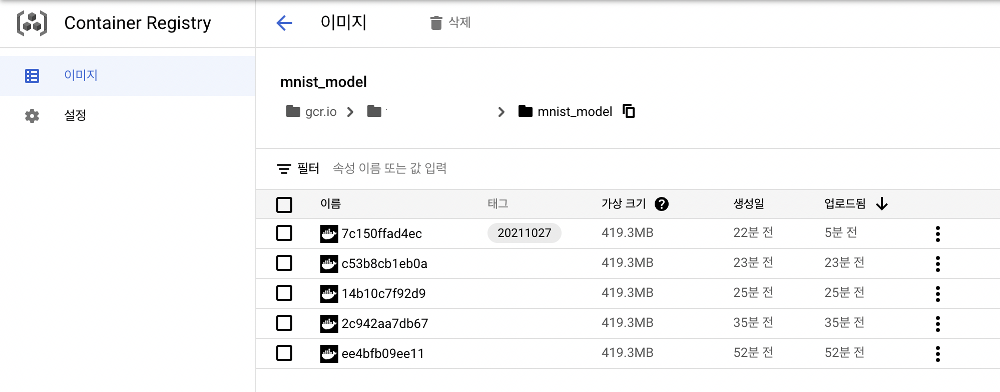

---

## 3. Vertex AI에 Train JOB 생성하기 

#### 1. Train Pipeline 만들기

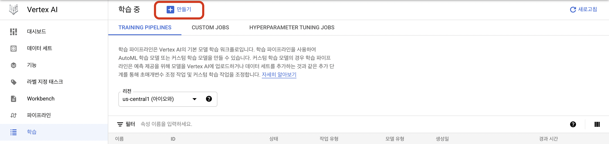

#### 2. Train Pipeline Configure

1. 학습방법
    Dataset: **관리형 데이터셋 없음** - 코드 내에서 load_data()를 통해 데이터를 불러온다.
2. 모델 세부정보
    Model name: 알아서 아무거나 하면된다. 나는 **mnist_train**
3. 학습 컨테이너
    1. **커스텀 컨테이너**
    2. **컨테이너 이미지**: Docker Push 한 경로를 찾아 선택하면 된다.
        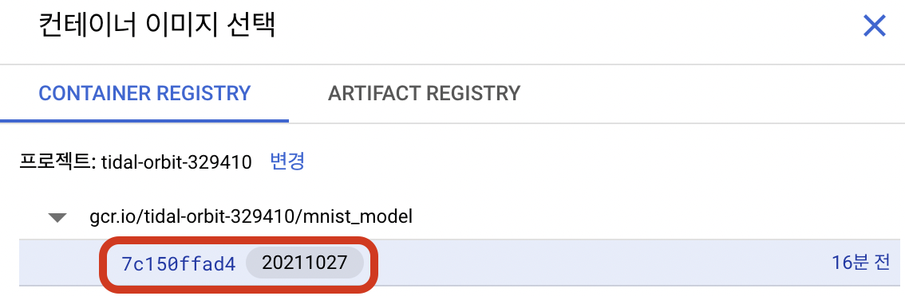
    3. gs 경로 `1. Train.py` 에서 model save 했던 경로를 선택해주면 된다. 나의 경우 **gs://suwan_test/20211027/model**

4. 초매개변수
    선택하지 않음

5. 컴퓨팅 및 가격 책정

    가장 저렴한 인스턴스인 **n1-standard-4, 4 vCPUs, 15GiB memory** 를 선택했다.

6. 예측 컨테이너
    Prediction을 위한 컨테이너를 생성해주는 부분이다. 
    **Pre-built container**
    Framework: **Tensorflow**

    Version: **2.6** Latest
    GPU: None
    Model Directory: 모델이 저장될 경로를 선택해주면 된다. 위에서의 gs 경로와 동일하다. **gs://suwan_test/20211027/model**

#### 3. 학습시작

이제 학습을 시작하면 된다.

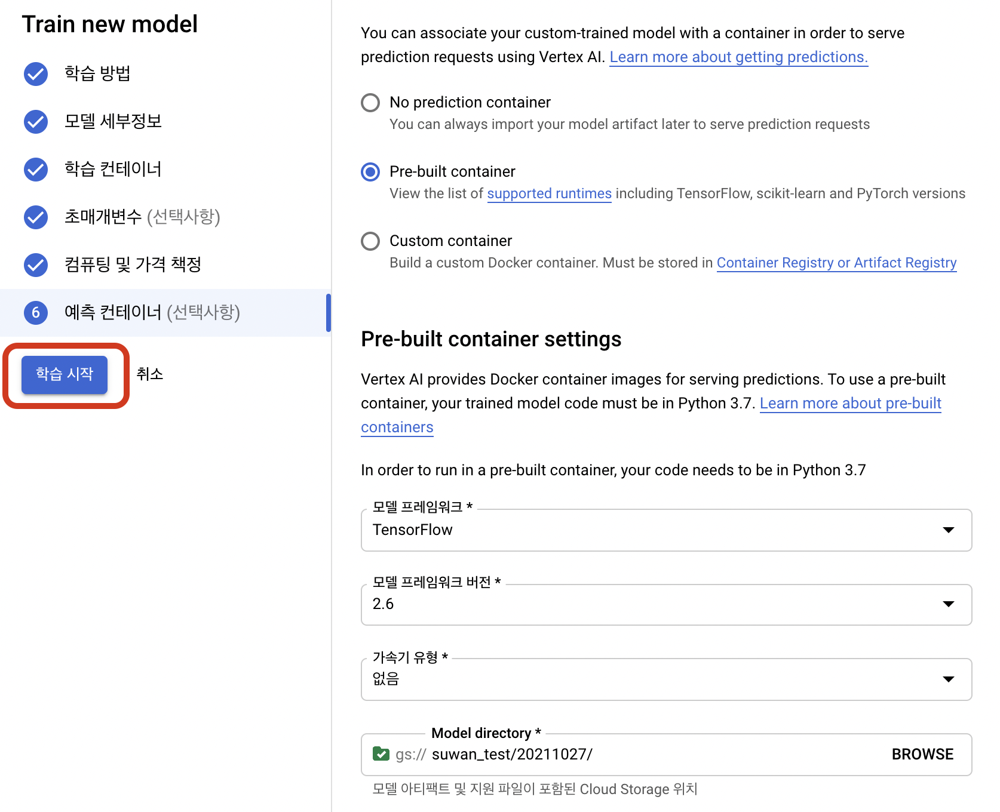

---

## 4. 배포 및 서빙

3에서 학습을 시작했으니까 조금 기다리면 아래와 같이 학습이 종료된 걸 확인할 수 있을 것이다.

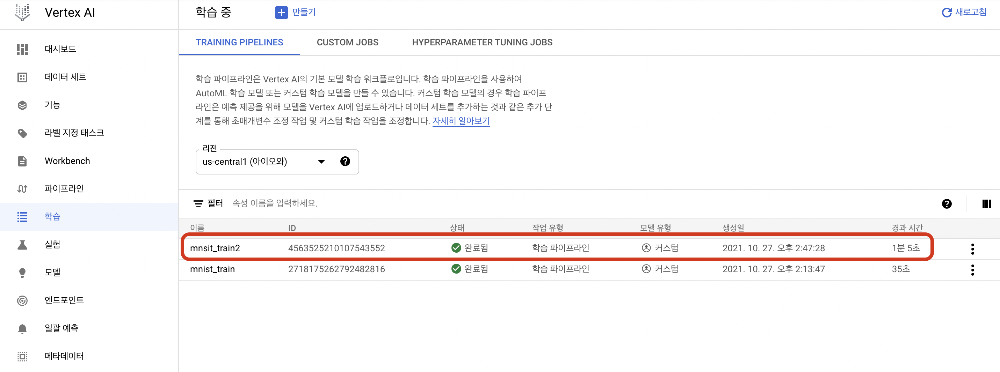


그리고 모델 탭이 가면 모델이 등록되어 있는 것도 확인할 수 있는 것이다. 이는  Train Pipeline Configure -> 예측 컨테이너를 설정해줬기 때문에 생성된 것이다.  

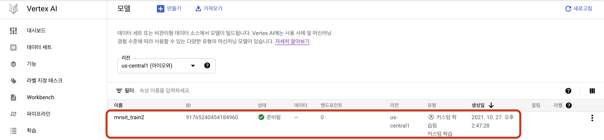


모델이름 클릭하면 세부 정보를 확인할 수 있다. 배포를 위해선 엔드포인트가 필요하고 없으면 생성해야한다. 

새 엔드포인트 만들기를 선택하고 적절한 이름을 짓자. 그리고 머신유형만 선택하면된다. 나의 경우 가장 저렴한 인스턴스인 **n1-standard-4, 4 vCPUs, 15GiB memory** 를 선택했다. 

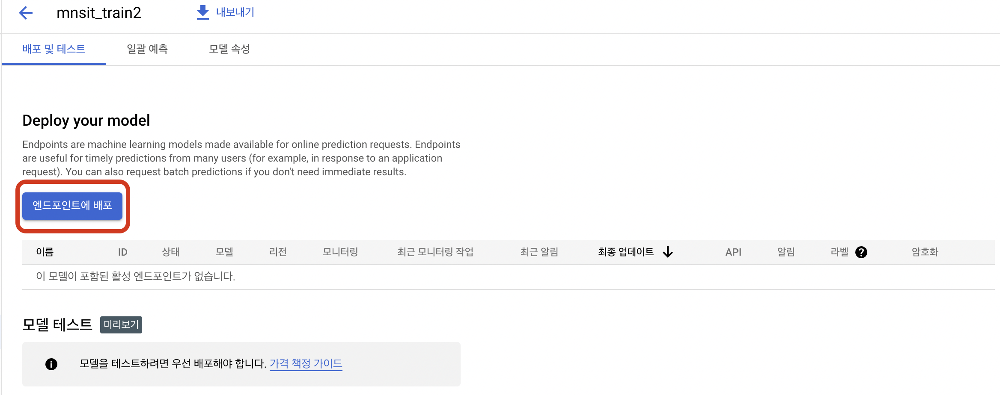


엔드포인트 배포를 선택하면 시간이 좀 걸리는데 이후에 엔드포인트 탭으로 이동하면 다음과 같이 잘 생성된 것을 확인할 수 있다.

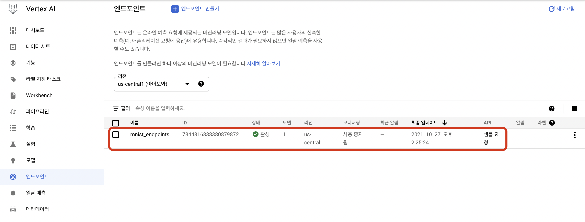


엔드포인트 이름을 클릭하면 세부정보를 확인할 수 있다. 엔드포인트 어떤 모델이 연결되어 있는지부터 예측/초, 예측 오차율, 요청/초, 총 지연시간 길이, 모델 지연시간 길이 등을 차트 간격(1시간, 6시간, 12시간, 1일, ~ 30일)으로 확인할 수 있다.

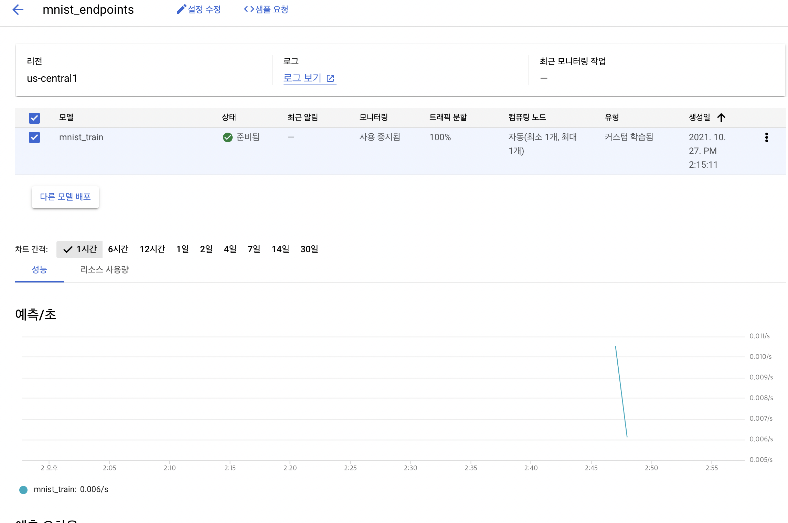

---

## 5. Test

엔드포인트가 생성되었으니 잘 동작하는지 확인해보자. 모델의 세부 정보에 들어가면 모델 테스트를 할 수 있다.

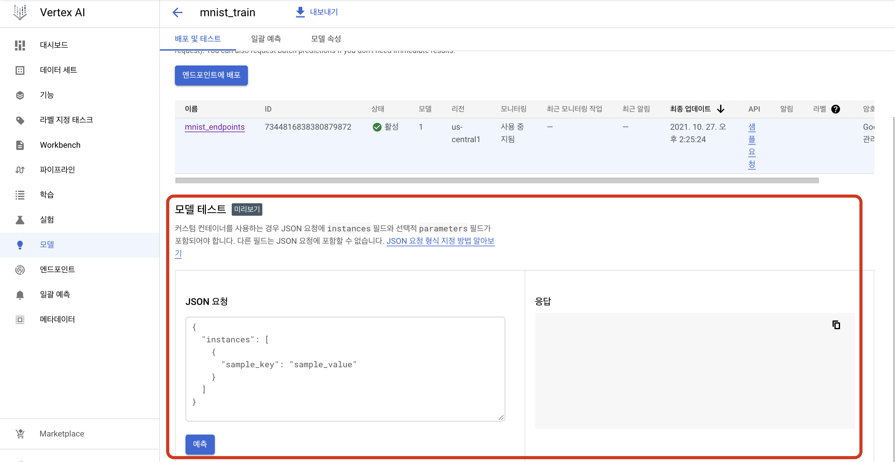


모델 테스트를 위해 JSON 요청을 보낼 수 있는데 각 인스턴스를 JSON 배열의 항목으로 만들고 배열을 JSON 객체의 `instances` 필드로 데이터를 제공해야 한다. 

그러니까 instances 라는 key의 value로 mnist 데이터를 줘야한다. test 이미지를 하나 넣기 위해 다시 MNIST 데이터를 불러와보자

```python
import tensorflow as tf

(_, _), (test_x, test_y) = tf.keras.datasets.mnist.load_data()
test_x = test_x / 255.0

test_x[0].tolist()
```

나오는 결과를 넣어 JSON을 완성하면 다음과 같다.

```json
{
  "instances": [
    [
      [
        0,
        0,
        ...
        0
      ],
      ...
      [
        0,
        0,
        ...
        0,
      ]
    ]
  ]
}
```


내가 받은 응답은 다음과 같다.

```json
{
 "predictions": [
   [
     0.00000536688867,
     2.52842867e-8,
     0.000187751983,
     0.00154095062,
     6.33089892e-9,
     0.0000025349284,
     3.57508412e-10,
     0.99822706, # 7
     0.0000055970122,
     0.0000307485061
   ]
 ],
 "deployedModelId": "4307737024044990464",
 "model": "projects/697793444829/locations/us-central1/models/4193418601081864192",
 "modelDisplayName": "mnist_train"
}
```

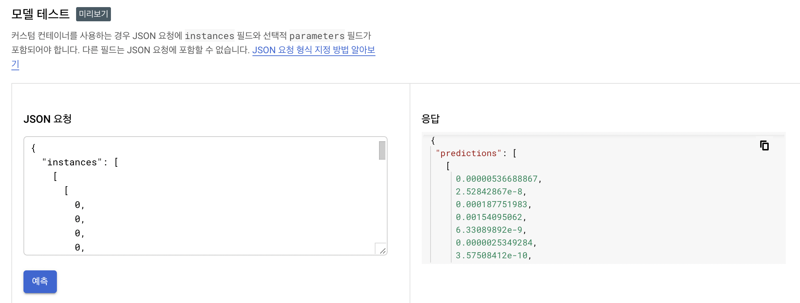
