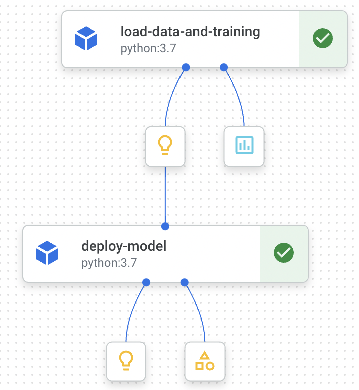
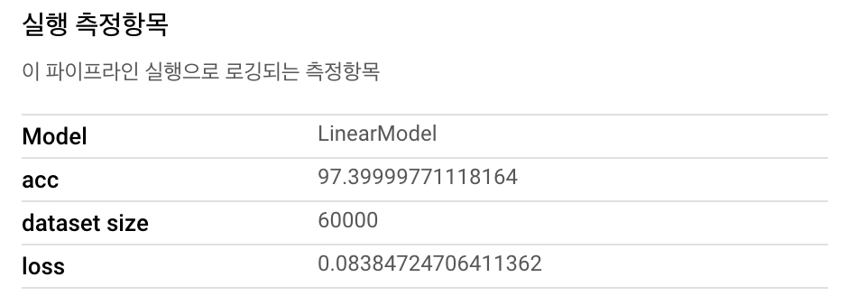
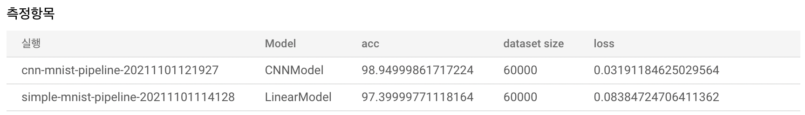
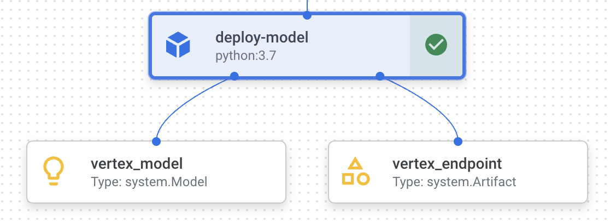
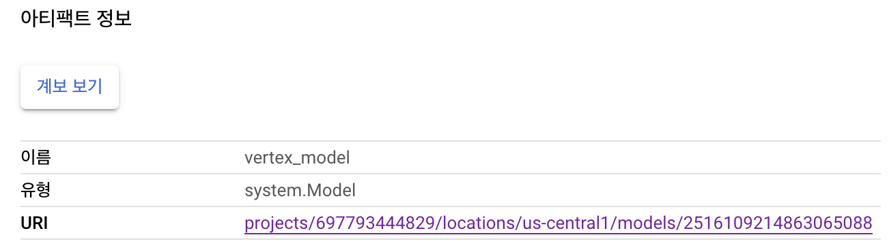

> 간단한 코드로 Vertex AI에서 모델 학습 및 배포하는 과정을 다룬다.

MNIST 데이터는 데이터를 불러오는 과정을 간단하게 `load_data`로 할 수 있기 때문에 아래와 같이 간단히 2개의 컴포넌트로 구성할 수 있다.

- Load data & Training
- Deploy with endpoint

아래의 과정을 따라오면 다음과 같은 파이프라인을 설계할 수 있다.



## 0. Import Library

Library를 불러오는 부분이다.

```python
import kfp
from kfp import dsl
from kfp.v2 import compiler
from kfp.v2.dsl import (Artifact, Dataset, Input, InputPath, Model, Output,
                        OutputPath, ClassificationMetrics, Metrics, component)

from google.cloud.aiplatform import pipeline_jobs

from datetime import datetime
```


## 1. Load data & Training Component

데이터를 불러와서 전처리 한 뒤 모델을 정의하고 학습을 진행할 것이다. 사실 각각의 컴포넌트로 구현을 하는 것이 옳을지 모르겠다. 간단하게 배포를 위한 포스팅이니 하나의 컴포넌트로 구성했다.

```python
@component(
    packages_to_install=["tensorflow"] # 1
)
def load_data_and_training(
    output_model: Output[Model], # 2
    metrics: Output[Metrics] # 3
):
    import tensorflow as tf
    
    mnist = tf.keras.datasets.mnist # 4
    (train_x, train_y), (test_x, test_y) = mnist.load_data()
    train_x = train_x / 255.0
    test_x = test_x / 255.0
    
    model = tf.keras.Sequential( # 5
        [
            tf.keras.layers.Flatten(input_shape=(28, 28)),
            tf.keras.layers.Dense(128, activation='relu'),
            tf.keras.layers.Dense(10, activation='softmax')
        ]
    )
    model.compile( # 6
        optimizer='adam',
        loss='sparse_categorical_crossentropy',
        metrics=['accuracy']
    )
    model.fit(train_x, train_y, epochs=3) # 7
    loss, acc = model.evaluate(test_x, test_y) # 8
    
    metrics.log_metric("acc", (acc*100.0)) # 9
    metrics.log_metric("loss", loss)
    metrics.log_metric("Model", "LinearModel")
    metrics.log_metric("dataset size", len(train_x))
    
    model.save(output_model.path) # 10

    print(f"Model saved path : {output_model.path}")
    print(f"Model saved uri : {output_model.uri}")
```

코드 옆에 주석으로 숫자를 표시해두었다. 간단하게 설명을 적어두려 한다.

- 1: `kip.v2.dsl` 에 정의된 `component`  데코레이터이다. 일반 함수를 파이프라인 컴포넌트로 변경해준다. 3개의 argument를 사용할 수 있다.
    - `base_image` : 지정해주지 않으면 기본적으로 python:3.7 이미지를 사용한다.
    - `output_component_file` : component에 정의된 내용을 `yaml` 파일로 작성하여 협업을 위해 사용하거나 다른 파이프라인에서 사용할 수 있다.
    - `packages_to_install`: base_image에서 추가적으로 패키지를 설치할 때 사용한다. 패키지 리스트를 입력해주면 된다. 나의 경우 python:3.7 이미지에 tensorflow를 설치했다.
- 2: Ouput은 컴포넌트의 출력을 정의할 수 있다. 훈련한 모델을 저장하기 위한 경로를 Deploy Component에서 사용하기 위해 출력했다.
- 3: Metrics은 위와같이 `log_metric` 으로 값을 주면 Vertex AI Pipeline의 "실행 측정항목" 에서 확인할 수 있을 뿐만 아니라 여러개의 파이프라인을 선택하여 Metrics에 입력한 값을 기반으로 서로 비교할 수 있다.
- 4: MNIST 데이터셋의 불러오고 전처리를 하는 과정이다.
- 5: Tensorflow로 간단한 Linear Model을 정의하는 부분이다.
- 6: 모델 학습과정을 정의하는 compile 부분이다.
- 7: 모델 학습
- 8: 모델 평가, 기본적으로 loss를 반환하고 `compile` 시 `metrics` 로 지정했던 측정항목들이 순서대로 출력된다.
- 9: 3번에서 이야기했던 Component mertric을 지정하는 부분이다. key value의 쌍으로 값을 준다.
- 10: 모델을 저장하는 부분이다. Output으로 지정했던 output_model의 path에 모델을 저장한다


Metrics의 `log_metric` 으로 지정한 뒤 학습의 결과는 다음과 같이 확인할 수 있다.



CNN 모델을 하나 더 만들어서 간단하게 비교해보았다. 참고로만 보자.



## 2. Deploy with endpoint

앞서 저장한 모델을 서빙하는 부분이다. 모델을 배포하고 endpoint를 생성하여 연결한다.

```python
@component(
    packages_to_install=["google-cloud-aiplatform"]
)
def deploy_model(
    model: Input[Model],
    project: str,
    region: str,
    vertex_endpoint: Output[Artifact],
    vertex_model: Output[Model]
):
    from google.cloud import aiplatform

    aiplatform.init(project=project, location=region) # 1

    deployed_model = aiplatform.Model.upload( # 2
        display_name="simple-mnist-pipeline",
        artifact_uri = model.uri,
        serving_container_image_uri="us-docker.pkg.dev/vertex-ai/prediction/tf2-cpu.2-6:latest"
    )
    endpoint = deployed_model.deploy(machine_type="n1-standard-4") # 3

    # Save data to the output params
    vertex_endpoint.uri = endpoint.resource_name # 4
    vertex_model.uri = deployed_model.resource_name 
```

- 1: 모델을 업로드하는 과정은 google cloud의 서비스에 종속적이다.
- 2: 모델 서빙을 위해서 저장한 모델을 불러와서 Vertex ai에서 관리하는 모델로 등록한다. 이때 어떠한 이미지를 기반으로 serving 모델을 만들지 `serving_container_image_uri ` 로 지정해줘야 한다.  [여기](https://console.cloud.google.com/artifacts/docker/vertex-ai/us/prediction)에 들어가면 Prediction을 위한 다양한 베이스 이미지를 확인할 수 있다.
- 3: 2에서 업로드한 모델을 endpoint와 연결짓는 부분이다. endpoint를 인자로 주지 않으면 disploy_name의 이름으로 자동으로 생성된다. 여기서 배포를 위한 replicas, accelartor 그리고 하나의 엔드포인트에 여러개의 모델이 연결될 수 있으므로 traffic_percentage 등도 설정이 가능하다. [여기](https://googleapis.dev/python/aiplatform/latest/aiplatform.html#google.cloud.aiplatform.Model.deploy)를 참고하자.
- 4: component의 Output으로 지정한 `vertex_endpoint` , `vertex_model` 이 처음으로 등장했는데, 단순히 컴포넌트의 결과로서 배포된 모델의 정보와 Endpoint의 정보를 확인하기 위함이다. 사실 꼭 필요한 부분은 아니다. 


4번과 같이 Ouput을 지정해주면 아래의 사진과 같이 Pipeline에서 정보들을 출력해준다.



그리고 각 아티팩트의 세부정보를 확인해보면 uri를 확인할 수 있다.



## 3. Define Pipeline

위에서 정의한 두개의 컴포넌트를 실행하는 Pipeline을 작성한다.

```python
@dsl.pipeline(
    pipeline_root=PIPELINE_ROOT, # 1
    name="simple-mnist-pipeline",
)
def pipeline(
    project: str = PROJECT_ID, # 2
    region: str = REGION
):
    load_data_and_training_task = load_data_and_training() # 3

    deploy_task = deploy_model( # 4
        model=load_data_and_training_task.outputs["output_model"],
        project=project,
        region=region
    )
```

- 1: 파이프라인을 실행하면서 생성될 Artifacts를 저장하기 위한 중간 저장소이다. MinIO, S3, GCS 등을 사용할 수 있다.
- 2: 앞서 설명했다시피 `deploy_model` 의 경우 google cloud에 종속적이다. 파라미터로 값을 받아 deploy를 위해 사용한다.
- 3: 처음으로 정의한 Load data & Training Component 를 실행하는 부분이다.
- 4: 두번째로 정의한 Deploy with endpoint 를 실행하는 부분이다. load_data_and_training_task의 ouput 중 output_model를 불러와 입력으로 사용한다.


## 4. Run Pipeline

정의한 파이프라인을 Vertex AI에서 실행하는 부분이다.

```python
TIMESTAMP = datetime.now().strftime("%Y%m%d%H%M%S")

compiler.Compiler().compile(
    pipeline_func=pipeline, package_path="simple_mnist_pipeline.json"
)

run = pipeline_jobs.PipelineJob(
    display_name="simple-mnist-pipeline",
    template_path="simple_mnist_pipeline.json",
    job_id="simple-mnist-pipeline-{0}".format(TIMESTAMP),
    parameter_values={},
    enable_caching=True,
)

run.run(sync=False)
```

