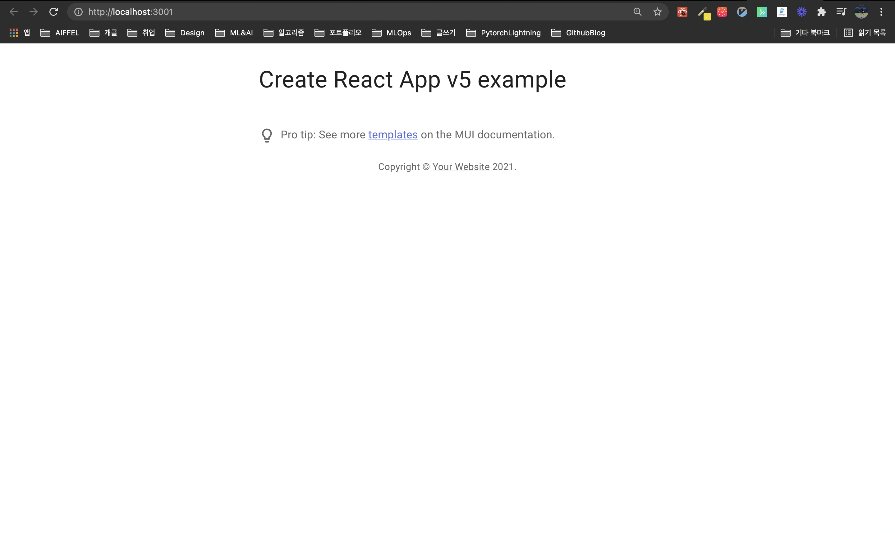
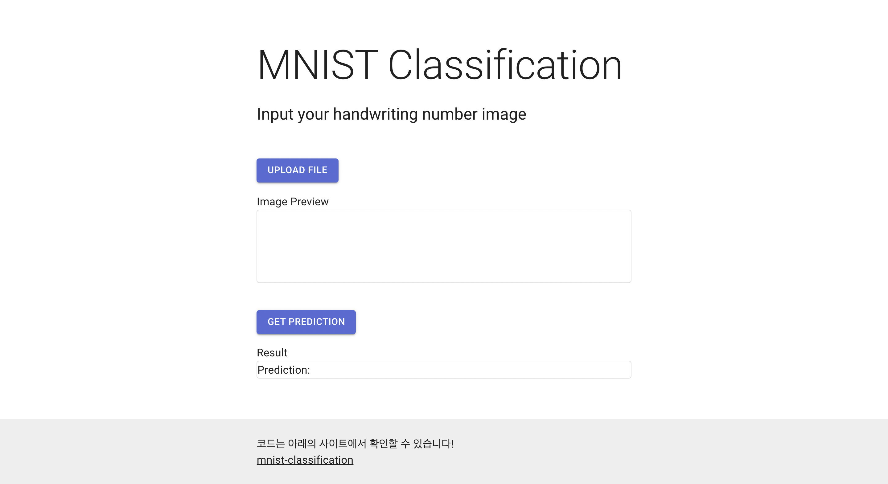

# 서비스를 위한 프론트엔드 구축

실험 날짜: 2021년 10월 9일
실험자: Suwan Jang


이미지를 입력받고 서버로 전송한다. 서버로부터의 결과를 받으면 출력한다.

### 📚 Stack

- React
- Material UI
- Axios

## Logs

---

### React project init

~~React 프로젝트를 `create-react-app` 으로 구축하였다.~~

Material UI는 리액트를 위한 UI 프레임워크이다. MUI 에서 제공하는 Project Init을 사용한다.

[링크](https://github.com/mui-org/material-ui/tree/master/examples/create-react-app)

**✓ Init & Install**

```bash
curl https://codeload.github.com/mui-org/material-ui/tar.gz/master | tar -xz --strip=2 material-ui-master/examples/create-react-app

cd create-react-app

yarn
```

**✓ Start**

```bash
yarn start
```

- 결과 페이지
  
    
    

[localhost:3000](http://localhost:3000) 에 접속하면 결과 페이지의 내용을 확인할 수 있다.

**✓ 서비스를 위한 컴포넌트 배치**

- Title 변경
- Upload Button
- Image Preview
- Get Prediction Button
- Result Typography
- Footer

- `App.js`
  
    ```jsx
    import * as React from 'react';
    import { useState } from 'react'
    import CssBaseline from '@mui/material/CssBaseline';
    import Box from '@mui/material/Box';
    import Button from '@mui/material/Button';
    import Typography from '@mui/material/Typography';
    import Container from '@mui/material/Container';
    import Link from '@mui/material/Link';
    import Paper from '@mui/material/Paper';
    
    export default function App() {
      const [img, setImg] = useState([]);
      const [imgurl, setImgurl] = useState();
      const [result, setResult] = useState();
      const [loading, setLoading] = useState(false);
    
      const onChange = (e) => {
        setImg(e.target.files[0]);
        setImgurl(URL.createObjectURL(e.target.files[0]))
      }
      const onClick = async () => {
        setLoading(true);
        const formData = new FormData();
        formData.append('file', img);
        // 서버의 upload API 호출
        const res = await axios.post("http://localhost:5000/predict", formData);
        setResult(res.data.class_name)
        setLoading(false);
      }
    
      return (
        <Box
          sx={{
            display: 'flex',
            flexDirection: 'column',
            minHeight: '100vh',
          }}
        >
          <CssBaseline />
          <Container component="main" sx={{ mt: 8, mb: 2 }} maxWidth="sm">
            <Typography variant="h2" component="h1" gutterBottom>
              MNIST Classification
            </Typography>
            <Typography variant="h5" component="h2" gutterBottom>
              {'Input your handwriting number image'}
            </Typography>
    
            <Button
              variant="contained"
              component="label"
              sx={{ mt: 5 }}
            >
              Upload File
              <input
                type="file"
                hidden
                onChange={onChange}
              />
            </Button>
            <Typography sx={{ mt: 2 }}>
              Image Preview
            </Typography>
            <Paper variant="outlined" sx={{ y: 10 }}>
              
            </Paper>
            <Button
              variant="contained"
              component="label"
              sx={{ mt: 5 }}
              onClick={onClick}
            >
              Get Prediction
    
            </Button>
            <Typography sx={{ mt: 2 }}>
              Result
            </Typography>
            <Paper variant="outlined" sx={{ y: 10 }}>
              <Typography >
                Prediction: <Typography style={{ color: "#00adb5" }}>{result}</Typography>
              </Typography>
            </Paper>
          </Container>
    
          <Box
            component="footer"
            sx={{
              py: 3,
              px: 2,
              mt: 'auto',
              backgroundColor: (theme) =>
                theme.palette.mode === 'light'
                  ? theme.palette.grey[200]
                  : theme.palette.grey[800],
            }}
          >
            <Container maxWidth="sm">
              <Typography variant="body1">
                코드는 아래의 사이트에서 확인할 수 있습니다!
              </Typography>
              <Link color="inherit" href="https://github.com/ssuwani/mnist-classification">
                mnist-classification
              </Link>{' '}
            </Container>
          </Box>
        </Box>
      );
    }
    ```
    
- 결과 페이지
  
    
    

**✓ Python 서버와의 통신**


`Axios`는 HTTP 비동기 통신을 위한 라이브러이이다. 

이미지를 전달해야 하기 때문에 POST 방식을 사용하였다. formData에 file이라는 key값에 입력받은 이미지를 넣어 [localhost:5000](http://localhost:5000) 에 전송한다. 결과를 parsing해서 setResult를 통해 result에 담는다. (서버에서 전달받는 결과는 class_name이라는 key값을 포함해야한다. (에외처리에 대한 내용이 있으면 좋을 것 같다.)

```jsx
const onClick = async () => {
    setLoading(true);
    const formData = new FormData();
    formData.append('file', img);
    // 서버의 upload API 호출
    const res = await axios.post("http://localhost:5000/predict", formData);
    setResult(res.data.class_name)
    setLoading(false);
  }
```