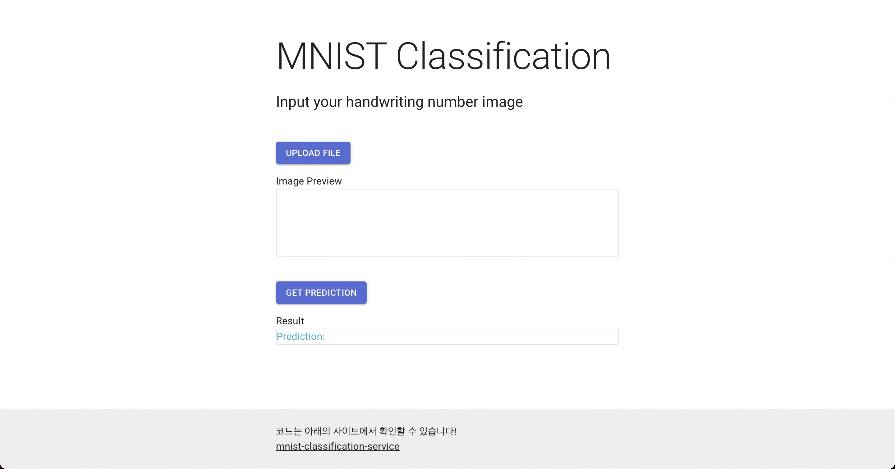

# Kubernetes 위에 올려보자

실험 날짜: 2021년 10월 12일
실험자: Suwan Jang


앞서 도커로 MNIST 분류 서비스를 위한 각 Task를 이미지로 만들었다. 또한 컨테이너간 데이터 저장을 위해 도커 볼륨도 하나 만들었다.

이제 이를 쿠버네티스 위에서 올려서 조금 더 유연하게 관리해보자.

### 📚 Stack

- Kubernetes
- Network

✅ **TODO**

- [x]  PV & PVC
- [x]  MNIST Train & Save Model in PVC
- [x]  MNIST Serving
- [x]  Run React App

#### **✓ PV & PVC**

hostPath PV를 생성한다. 이는 단일노드에서만 지원된다. 

minikube ssh를 통해 클러스터 노드의 셸에 접속해 연결을 위한 디렉토리를 하나 생성하자

```bash
minikube ssh
sudo mkdir /mnt/mnist # 사실 꼭 안해도 자동으로 생성된다.
```

- pv-volume.yaml
    
    ```yaml
    apiVersion: v1
    kind: PersistentVolume
    metadata:
      name: mnist-pv-volume
      labels:
        type: local
    spec:
      storageClassName: mnist
      capacity:
        storage: 3Gi
      accessModes:
        - ReadWriteOnce
      hostPath:
        path: "/mnt/mnist"
    ```
    
- pv-claim.yaml
    
    ```yaml
    apiVersion: v1
    kind: PersistentVolumeClaim
    metadata:
      name: mnist-pv-claim
    spec:
      storageClassName: mnist
      accessModes:
        - ReadWriteOnce
      resources:
        requests:
          storage: 3Gi
    ```
    

```bash
kubectl apply -f pv-volume.yaml
kubectl apply -f pv-claim.yaml
```

위를 각각 실행하면 아래와 같이 PV에서 PVC가 적용된 것을 확인할 수 있고 PVC에서도 확인할 수 있다.

```bash

> kubectl get pv
NAME                                       CAPACITY   ACCESS MODES   RECLAIM POLICY   STATUS      CLAIM                          STORAGECLASS   REASON   AGE
mnist-pv-volume                            3Gi        RWO            Retain           Bound       default/mnist-pv-claim         mnist                   9m11s

> kubectl get pvc
NAME             STATUS   VOLUME            CAPACITY   ACCESS MODES   STORAGECLASS   AGE
mnist-pv-claim   Bound    mnist-pv-volume   3Gi        RWO            mnist          8m25s
```

#### **✓ MNIST Train & Save Model in PVC**

쿠버네티스에서 배포를 위한 가장 작은 단위인 Pod는 여러개의 워커로드 즉, 애플리케이션 위에서 동작한다. Task에 따라 적절한 애플리케이션을 선택해야한다.

하나의 Pod를 생성하고 안정적으로 실행하는게 초점을 맞춘 Job이 MNIST 모델 학습을 위해 적절하다고 판단하였다.

- mnist-train-job.yaml
    
    ```yaml
    apiVersion: batch/v1
    kind: Job
    metadata:
      name: mnist-train-job
    spec:
      template:
        spec:
          volumes:
            - name: mnist-storage
              persistentVolumeClaim:
                claimName: mnist-pv-claim
    
          containers:
            - name: mnist-train-container
              image: ssuwani/mnist_train
              args: ["--epochs", "1", "--save-model", "--save-model-path", "/app/mnist.pt"]
              volumeMounts:
                - mountPath: "/app"
                  name: mnist-storage
          restartPolicy: Never
      backoffLimit: 4
    ```
    

.spec.volumes를 보면 이전에 만든 `mnist-pv-claim` 를 사용하는 `mnist-storage`를 생성한 것을 확인할 수 있다. 또한 `ssuwani/mnist_train` 를 실행하는 컨테이너가 `mnist-storage`를 `/app` 위치로 마운트했다.

**Job 실행**

```bash
kubectl apply -f mnist-train-job.yaml
```

**결과확인**

Job과 Pod를 확인하고 실행된 Pod의 Log를 확인해보면 동작이 잘 되었는지 확인할 수 있다.

```bash
> kubectl get job
NAME              COMPLETIONS   DURATION   AGE
mnist-train-job   1/1           27s        7m11s

> kubectl get pods
NAME                    READY   STATUS      RESTARTS   AGE
mnist-train-job-twdvv   0/1     Completed   0          7m14s

> kubectl logs mnist-train-job-twdvv
100.0% # MNIST 데이터를 다운받는 과정이다.
102.8%
100.0%
112.7%
--- 이하 생략
```

또한 학습이 종료되면서 PVC로 연결된 위치에 모델을 저장하였다. 노드 셸에 접속하여 연결 해 둔 `/mnt/mnist` 폴더에 잘 저장이 되었는지 확인해보자.

```bash
> minikube ssh
Last login: Tue Oct 12 08:38:50 2021 from 192.168.49.1
docker@minikube:~$ ls /mnt/mnist/

mnist.pt # ><
```

**✓ MNIST Serving (Deployment + Service)**

Flask 를 실행하는 이미지를 쿠버네티스 디플로이먼트를 만들고 서비스로 만들어보자

- mnist-serving.yaml
    
    ```yaml
    apiVersion: apps/v1
    kind: Deployment
    metadata:
      name: mnist-serving-deployment
      labels:
        app: mnist-serving
    spec:
      replicas: 3
      selector:
        matchLabels:
          app: mnist-serving
      template:
        metadata:
          labels:
            app: mnist-serving
        spec:
          containers:
          - name: mnist-serving
            image: ssuwani/mnist_app
            args: ["--model_path", "/app/mnist.pt"]
            ports:
            - containerPort: 5000
            volumeMounts:
              - mountPath: "/app"
                name: mnist-storage
          volumes:
            - name: mnist-storage
              persistentVolumeClaim:
                claimName: mnist-pv-claim
    ```
    

```bash
k apply -f mnist-serving.yaml
```

Deployment는 `.spec.replicas` 즉 레플리카셋을 기본적으로 설정할 수 있다. 파일의 내용과 같이 `replicas: 3` 로 설정하면 Pod를 3개 만든다는 이야기다. 이에 따른 강점을 영상으로 잠깐 찍어봤다.

[replicas-test.mov](images/replicas-test.mov)

Train 때와 마찬가지로 만들어진 Pod의 Logs를 확인해보자

```bash
> kubectl get pods
NAME                                        READY   STATUS      RESTARTS   AGE
mnist-serving-deployment-5994976558-78cm6   1/1     Running     0          4m32s
--- 생략 ---

> k logs mnist-serving-deployment-5994976558-78cm6
--- 생략 ---
 * Running on http://172.17.0.73:5000/ (Press CTRL+C to quit) # 잘 실행된 걸 확인할 수 있다.
--- 생략 ---
```

위의 logs에서  `* Running on [http://172.17.0.73:5000/](http://172.17.0.73:5000/)` 가 보인다. 이는 쿠버네티스 클러스터의 내부주소이다. 클러스터 내부에선 접속이 가능하지만 로컬 혹은 원격에선 접속하기 어렵다. 이게 서비스를 이용하는 가장 큰 이유라고 생각한다. 

클러스터 내부에서 접속이 가능하다는 걸 증명해보자. 간단하다 minikube ssh 로 노드 셸에 접속해서 연결을 확인해보자

```bash
> minikube ssh
Last login: Tue Oct 12 09:31:23 2021 from 192.168.49.1

docker@minikube:~$ curl http://172.17.0.73:5000/
{
  "error": "use POST /prediction instead of root route"
}
```

출력은 에러라고 나와서 혼란이 있을 수 있지만 내가 설정해놓은 리턴값이다. 정상적으로 실행되었다.

**서비스 연결하기**

- mnist-serving-service.yaml
    
    ```yaml
    apiVersion: v1
    kind: Service
    metadata:
      name: mnist-service
    spec:
      selector:
        app: mnist-serving
      ports:
        - protocol: TCP
          port: 1234
          targetPort: 5000
      type: NodePort
    ```
    

selector로 서비스 대상을 결정한다. 위에서 `mnist-serving.yaml` 에서 `.spec.template.metadata.labels` 로 생성된 Pod의 Label의 일치를 계속해서 추적한다.

```yaml
# mnist-serving.yaml
labels:
  app: mnist-serving

# mnist-serving-service.yaml
selector:
	app: mnist-serving
```

서비스 실행하기

```bash
kubectl apply -f mnist-serving-service.yaml
```

서비스가 잘 생성되었는지 확인해보자

```bash
> kubectl get services
NAME            TYPE        CLUSTER-IP      EXTERNAL-IP   PORT(S)          AGE
mnist-service   NodePort    10.103.250.89   <none>        1234:31322/TCP   28m

> kubectl describe services/mnist-service
Name:                     mnist-service
Namespace:                default
Labels:                   <none>
Annotations:              <none>
Selector:                 app=mnist-serving
Type:                     NodePort
IP Families:              <none>
IP:                       10.103.250.89
IPs:                      10.103.250.89
Port:                     <unset>  1234/TCP
TargetPort:               5000/TCP
NodePort:                 <unset>  31322/TCP
Endpoints:                172.17.0.72:5000,172.17.0.73:5000,172.17.0.74:5000
Session Affinity:         None
External Traffic Policy:  Cluster
Events:                   <none>
```

NodePort가 31322로 잡혀있고 EndPoint로 3개의 Pod가 잘 잡혀있는것을 확인할 수 있다. 서비스의 포트와 노드포트에 대한 내용이 이해될 듯 조금 헷갈린다.. 더 공부하자.

`{clusterIP}:{NodePort}` 에 접근하면 노드포트에 연결된 Pod에 접근할 수 있다. 어떤 파드에 접근할지는 쿠버네티스가 알아서 정해준다.

어떻게 알아서 정해주냐는 너무 깊은 이야기지만 실험을 통해 실제로 적절히 알아서 정해주는지 확인해보았다.

영상의 왼쪽은 watch 명령어로 3개의 Pod의 Log를 확인하고 있다. 

영상의 오른쪽은 curl 명령어로 0.5초마다 한번씩 NodePort를 통해 Pod에 요청을 보냈다.

- 명령어
    
    watch log
    
    `watch -n1 "kubectl logs mnist-serving-deployment-5994976558-8hhcx | tail -n $(($LINES - 2))"`
    
    curl + while
    
    `while true; do sleep 0.5; curl 192.168.49.2:31322; done;`
    

[NodePort.mov](images/NodePort.mov)

너무 길어지지만 하나 더 하고 넘어가야한다.

클러스터 IP로 Service에 접근할 수 있지만 이 또한 분명 내 PC에서 동작하는 클러스터이기 때문에 외부에서 접근할 수 없다. 쿠버네티스에선 포트포워딩을 이용해 클러스터 내 애플리케이션에 접근이 가능하다.

이를 통해 ClusterIP + NodePort로 접근했던 것이 Local IP + Local Port 로 접근이 가능해지는 것이다. 이는 또 Local PC가 연결된 네트워크의 포트포워딩을 통해 외부 IP로서도 접근이 가능하다는 이야기다. 

포트포워딩으로 클러스터 내 애플리케이션에 접근 (로컬포트와 서비스포트의 연결)

```bash
kubectl port-forward service/mnist-service 5000:1234
# 이는 
```

참고: kubectl port-forward 는 프롬프트를 리턴하지 않으므로, 이 연습을 계속하려면 다른 터미널을 열어야 한다.  ([참조](https://kubernetes.io/ko/docs/tasks/access-application-cluster/port-forward-access-application-cluster/))

5000은 로컬 포트를 1234는 위에서 `kubectl describe services/mnist-service` 를 실행해 보았던 Service Port이다. 

이제 [localhost:5000](http://localhost:5000) 는 서비스포트 1234에 접근하는 것과 동일하다. 이는 또 다시 ClusterIP + NodePort와 동일하다. 

```bash
# 또 다른 터미널을 열어 확인하였다.
> curl localhost:5000
{
  "error": "use POST /prediction instead of root route"
}
```

- local IP가 아니라 외부 IP에서도 접근할 수 있게 설정하기
    
    쿠버네티스가 동작하는 PC의 네트워크의 포트포워딩을 해야한다. 나의 경우 내 PC는 iptime 공유기에 연결되어 있다. 
    
    iptime의 경우 고급설정 - NAT/라우터 관리 - 포트포워드 설정에서 다음과 같이 설정을 추가해주면 된다.
    
    
    
    그리고 포트포워딩 할 때 하나의 옵션을 추가해야 한다.
    
    ```bash
    kubectl port-forward service/mnist-service 5000:1234 --address 0.0.0.0
    ```
    
    address 에 대한 부분인데 기본값은 [localhost](http://localhost) 즉 127.0.0.1 이다. 이를 모든 네트워크에서 접근 가능하도록 0.0.0.0 으로 변경해주었다.
    
    이제 나는 지금 카페에 있는데 집에 있는 PC의 외부 IP + 5000 으로 쿠버네티스 Cluster 위에서 동작하는 Pod에 접근할 수 있다.
    
    ```bash
    (base)  suwan@Suwan-mac  ~  curl 182.161.xxx.200:5000
    {
      "error": "use POST /prediction instead of root route"
    }
    ```
    

**✓ Run React App**

사용자가 이미지를 입력하고 결과를 확인할 수 있는 웹 애플리케이션을 React로 만들었다. Kubernetes 위에 배포해보자.

방금전에 한 MNIST Serving 과 거의 똑같다. Deployment를 만들고 Service 연결하면된다.

- mnist-web.yaml
    
    ```yaml
    apiVersion: apps/v1
    kind: Deployment
    metadata:
      name: mnist-web-deployment
      labels:
        app: mnist-web
    spec:
      replicas: 1
      selector:
        matchLabels:
          app: mnist-web
      template:
        metadata:
          labels:
            app: mnist-web
        spec:
          containers:
            - name: mnist-web
              image: ssuwani/mnist_web-app
    ```
    
- mnist-web-service.yaml
    
    ```yaml
    apiVersion: v1
    kind: Service
    metadata:
      name: mnist-web-service
    spec:
      selector:
        app: mnist-web
      ports:
        - protocol: TCP
          port: 80
          targetPort: 80
      type: NodePort
    ```
    

```bash
kubectl apply -f mnist-web.yaml
kubectl apply -f mnist-web-service.yaml
```

**동작확인**

위에서 했던 것처럼 Cluster IP + NodePort 에 접근하면 정상적으로 동작을 확인할 수 있다. Local에서 클러스터 애플리케이션에 접근하기 위해 kubectl port-forward 해보자

```bash
kubectl port-forward service/mnist-web-service 8888:80
```

[localhost:8888](http://localhost:8888) 에 접근해보자



최종 동작 확인을 위해 mnist-service에 다시 연결해보자

```bash
kubectl port-forward service/mnist-service 5000:1234
```

이제 [localhost:5000](http://localhost:5000) 을 통해 MNIST Serving Flask APP 에 접근할 수 있다.

아래의 이미지를 다운받아서 결과가 잘 나오는지 확인해보자


**✓ ETC**

- Service Type(NodePort) 에 대한 내용 더 공부하자.
    
    [서비스](https://kubernetes.io/ko/docs/concepts/services-networking/service/)